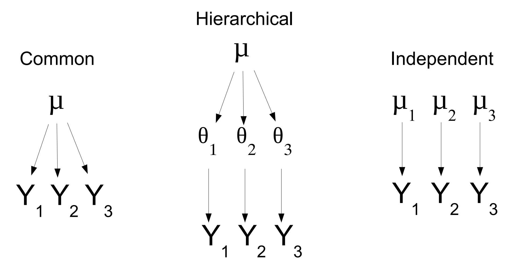

# Ecological Forecasting - Day 2

## Hierarchical Bayes

Presenter: Michael Dietze

Lecture: https://www.dropbox.com/s/px9yv0ui7b3wtrq/HierBayes.pdf?dl=0

Ecological data are complex, and it is important to bring the appropriate statistical tools for handling these idiosyncrasies. Standard statistical tools have so many assumptions because they needed to be solved analytically, now were have the tools to solve problems computationally and should try to account for the complexity of heterogenous ecological data.

### Concept



The example on the left describes the situation were all samples have the sample mean, or are dependent. The right condition describes each sample being fully independent. The reality is probably some here in the middle, which is represented in the hierarchical model. This partitioning of the distribution of variability can shift based on the distribution of the data. In other words, we allow the data to dictate level of dependence/independence.

This is an example of "borrowing strength", where information where the prior for information on one site comes from information on other sites.

### Independent Means, common variance

$$
Y_K \sim N(\mu_k, \sigma^2)
\\\mu_k \sim N(\mu, \tau^2)
\\\sigma^2 \sim IG(s_1, s_2)
$$

This model fits each data set independently but assumes the mean for each has the same prior. The hierarchical model instead assumes the prior contains unknown model parameters, for which they need to specifty hyperpriors on our prior.


$$
Y_K \sim N(\mu_k, \sigma^2)
\\\mu_k \sim N(\mu, \tau^2)
\\\sigma^2 \sim IG(s_1, s_2)
\\\mu \sim N(\mu_0, V\mu)
\\\tau^2 \sim IG(t_1, t_2)
$$

Everything that is an unknown needs a prior.

### Hierarchical models key
- Model variability
in the parameters of a model
- Partition variability more explicitly into multiple terms
- Borrow strength across data scientists- details usually in the **subscripts**
- Hierarchical with respect to the parameters

The details are usually in the subscripts, this denotes which parameters are random variables.

### Random effects

$$
Y_K \sim N(\mu_g + \alpha_k, \sigma^2)
\\\alpha_k \sim N(0, \tau^2)
\\\sigma^2 \sim IG(s_1, s_2)
\\\mu_g \sim N(\mu_0, V\mu)
\\\tau^2 \sim IG(t_1, t_2)
$$

This is similar to the previous model, expect that it is modelling how much each site *differs from the global means*. It assumes that the differences are centered around the global mean. This means that random effects always have a mean of 0. Random effects variance attributes a portion of the uncertainity to a specific source.

### What things can be random effects?

Typically they are aspects of the study that would not be the same if replicated (i.e. plot, block, year, individual).

Treatment and covariates of interest are usually treated as **fixed effects**.

Often there is some degree of replication, otherwise the random effect is not identifiably different from the residual "noise" term $e \sim N(0, \sigma^2)$

Hierarchical models allows preditictions about unobserved species, sites, years, etc. Out-of-sample predictions integrate over random effects, more uncertain than in-sample. This allows the posteriors for new species/site/years to be updated with a relatively small number of observations.

### Start Simple, then Progressively Add Complexity

#### Model 1: Global Mean

```
model{
  ## priors
  mu~ dnorm(0,0.001)
  sigma ~ dgamma(0.001, 0.001)

  for(t in 1:nt){
    for(b in 1:nb){
      for(i in 1:nrep){
        x[t,b,i] ~ dnorm(mu, sigma)
      }
    }
  }
}
```

#### Model 2: Random Temporal Effect

```
model{
  ## priors
  mu~ dnorm(0,0.001)
  sigma ~ dgamma(0.001, 0.001)
  for(t in 1:nt){alpha.t[t] ~ dnorm(0,tau.t)}
  tau.t ~ dgamma(0.001,0.001)

  for(t in 1:nt){
    Ex[t] <- mu + alpha.t[t] ## process model
    for(b in 1:nb){
      for(i in 1:nrep){
        x[t,b,i] ~ dnorm(mu, sigma) ## data model
      }
    }
  }
}
```

#### Model 3: Random Block effect

#### Model 4: Random Block & Time

### Random Effects Linear Model

$$
\mu_{i,k} = X_i\beta + \alpha\ + \epsilon_{i,k}
$$

### Explaining unexplained variance

Random effects attempt to account for the unexplained variance associated with a grouping factor due to all things that were not measured. This may point to scales that need additional explanation. Adding fixed effects may explain some additional portion of the variance, but there is always something that is not measured and adding additional effects is not always justifiable.

### Modeling uncertainty

Just as important to characterize uncertainty as it is to characterize the covariates.

Random effects are used to account for the impacts of unmeasured/unmeasurable covariates

## Machine Learning

 Presenter: Barbara Han

Ecological uses of cases for machine Learning
- ecological niche Modeling
- Conservation
- Invasion biology

### Machine learning vs. forecasting

Forecasting identifies some underlying **process model**, machine learning does not do this. ML relies entirely on data. Data assimlation methods use incoming data to update model states. The ML anology is online vs. offline

### Examples from disease ecological

Boosted regression trees

## State-Space models

Lecture:   
