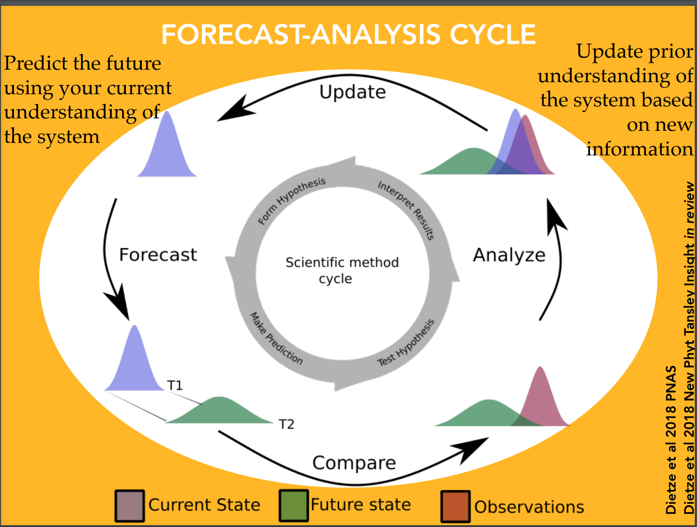

# Ecological Forecasting - Day 3

## Uncertainty Propagation

Presenter: Michael Dietze

Lecture: https://www.dropbox.com/s/mkz8jbtj3qvycn7/EF_Lecture08_Analyzing_Uncertainty.2018Summer.pdf?dl=0

### Concepts
Sensitivity analysis - How does a change in X translate into a change in Y

Uncertainty Propagation - How does the uncertainty in X affect the uncertainty in Y, and how do we forecast Y with uncertainty?

Uncertainty analysis - which sources of uncertainty are most important?

Optimal design - How do we best reduce the uncertainty in our forecast?

### Sensitivity methods
Local: analytically -> $df/d\theta$ , one-at-a-time perturbations

Global: Monte Carlo, Emulators, elementary effects, group sampling (Ranging from extensive but costly to sparse but cheap)

Sensitivity analysis can hold all parameter but one at their mean, and test range.

Monte Carlo sensitivity draws samples for each parameter from their joint distribution. Can create a regression to estimate  range for meaning cross combinations. The slope and $R^2$ provide useful information.

### Uncertainty Propagation

A special case of variable transformation. The forecasting the space that we are trying to transform is from the current model into the future.

| | Distribution | Moments
|---|---|---|
| Analytical | Variable transformation | Analytical moments, Taylor Series
| Numeric | Monte Carlo | Ensemble

Variable transformation is the gold standard, as it gives a closed-form equation for the full model. In practice, this is nearly impossible for any realized model (so probably don't try).

Analytical moments are easier to calculate, and provide meaningful information about a model like the mean and standard deviation. This only works for linear models.

### Transformation and sensitivity

The variable transformation is relatively straight foreword if we have a linear model (a function of the variance and sensitivity). For nonlinear models, we use a linear approximation.

Note: Jensen Inequaility dictates that for nonlinear models, the mean of a function is not equal to the output of a function evaluated at the parameter mean.

When you propagate uncertainty, the covariance between parameters is critically important. The covaria can not be dropped.

The consequences of the linear approximate is that the more nonlinear our model is, the worst our estiamtes of uncertainty.

### Numerical Propagation approximation

We approximate the distrubtion from samples of the posterior distrubtion.

The difference between ensembles and Monte Carlo is typically ensembles have fewer samples.

### Monte Carlo Uncertainty
```
for (i in 1:n)
  draw random values from Distributions
  run model
  save results
summarize distribution
```

The Key here is to sample rows in the MCMC. In other words, uses the parameters generated from each run of the MCMC, rather than summarizing the full set of paramters. This maintains the covariace.

### Ensemble uncertainty

```
for (i in 1:n)
  draw random values from Distributions
  run model
  save results
summarize distribution
fit PDF to results
```

The differences is that due to smaller sample size, we are less confident that our sample is an accurate representation of the distributions. So we can't get a clear picture of the distributions, but we can get some information by assuming a strictures. IN other words, we need far fewer samples to get stable estimates for the moments than are required to accurately estimate the full distribution. For a accurate estimation of a distribution, the effective sample size should be 5000.

If you have a computationally efficient model then run the full Monte Carlo.

### How do we measure predictability?

What causes variance to increases with time? This is a function of the terms disucessed earlier (the sources of uncertainty).

### Uncertainty Analysis

Two factors: Parameter uncertainty and sensitivity. This means that sensitivity byt itself does not tell you what is important in your model, as the sensitivety may be will constrained.

Most of the time, there are a small number of factors that drive uncertainty.

### Tools for model-data feedbacks
Power analysis: sample size needed to detect an effect size, and minimum effect size detectable give a size.

Observational design: What do I need to measure, where should I collect new data, how do I gain new info most efficiently.

#### Pseudo-data simulation
```
for(k in 1:M)
  Draw random data of size N
  fit models
  save parameter(s) of interest
```

### Observing systems simulation experiments

- Simulate "true" system
- Simulate pseudo-observations
- Assimilate pseudo-observations
- assess impact on estimates

## Anal Data Assimilation

Presenter: Michael Dietze

Lecture: https://www.dropbox.com/s/mj51o9gbakd2bv2/EF_Lesson09_DA1.2018_Summer.pdf?dl=0

#### The Forecast-Analysis cycle


### The Analysis Problem
*Prior* to observing how the future plays out, what is the best estimate of the future state of the system $X_{t+1}$? Our forecast $P(X_{t+1})$.

Once we make observations of the system $Y_t$ what our best estimate of $X_t$?

The data is imperfect, noise, and maybe shouldn't be trusted completely. It is likely better to combine that data with more into (i.e. our model).

$P(X_{t+1}|Y_{t+1}) \propto P(Y_{t+1}|X_{t+1})P(X_{t+1})$

##### BAYES!!

### Simplest Example

- Assume forecast $P(X_{t+1}) \sim N(\mu, \tau^2)$
- Assume $P(Y_{t+1}|X_{t+1}) \sim N(X_{t+1}, \sigma^2)$
  - Likelihood = Data Modeling
- Assume $Y, \mu, \tau^2, \sigma^2$ are known

This reduces to a weighted average of the likelihood and the prior, weighted by their precisions.

### Simplest Forecast

Only considering Process and initial conditions error

Uses normal conjugacy and linearitry to derive anayltically derive the paramters (mean and variance)

Call the Kalman Filter

### Generalize to Multivariate

Basically, hit it with linear algebra.

### Pro/Con of the Kalman Filter (KF)

Pros:
- Analytically tractable
- depends only upon the previous state, the current forecast, and the current dataset

Cons (mostly):
- Linear
- Normal
- Matrix inversion
- Assumes all parameters are **known**
- Forward only

Historically, the linearity assumptions were the biggest constrait. However, we can use the Taylor approximation to handle nonlinear models

### Extended Kalman Filter

Used to address the linear assumption of the Forecast

$\mu_f = f(\mu_a)$

Update variance using a Taylor Series expansion

F = Jacobian($df_i/dx_j$)

$P_f \approx Q + FP_aF^T$

Jensen's Inequality means that this is biased and that the normality assumption is violated.
